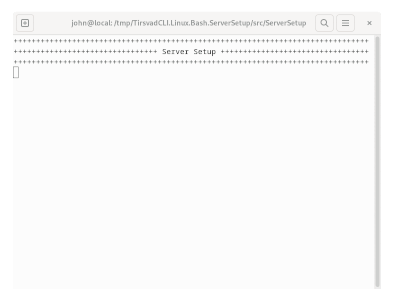

<!-- BADGES V1 -->
[![Contributors][contributors-shield]][contributors-url]
[![Forks][forks-shield]][forks-url]
[![Stargazers][stars-shield]][stars-url]
[![Downloads][downloads-shield]][downloads-url]
[![Issues][issues-shield]][issues-url]
[![MIT License][license-shield]][license-url]
[![LinkedIn][linkedin-shield]][linkedin-url]

<br />
<div align="center">
    <a href="https://github.com/TirsvadCLI/Linux.Bash.ServerSetup">
        
    </a>
    <h3 align="center">Server Setup</h3>
    <p align="center">
    To remote configure your fresh installed OS on server.
    <br />
    <a href="https://github.com/TirsvadCLI/Linux.Bash.ServerSetup/blob/main/images/run.gif">
        
    </a>
    <br />
    <!-- PROJECT SCREENSHOTS -->
    <br />
    <a href="https://github.com/TirsvadCLI/Linux.Bash.ServerSetup"><strong>Explore the docs »</strong></a>
    <br />
    <br />
    <a href="https://github.com/TirsvadCLI/Linux.Bash.ServerSetup/issues/new?labels=bug&template=bug-report---.md">Report Bug</a>
    ·
    <a href="https://github.com/TirsvadCLI/Linux.Bash.ServerSetup/issues/new?labels=enhancement&template=feature-request---.md">Request Feature</a>
    </p>
</div>

# Linux Server Setup

This script aimed goal is to set up a complete web server environment. Script can be run from a local system with internet access to server.

## Table of Contents

- [Important](#important)
- [Requirement](#requirement)
- [Installation](#installation)
- [Features](#features)
- [Roadmap](#roadmap)
- [Development](#development)
- [Folder Structure](#folder-structure)

## Important

We are reconstruction the script from scratch

If you need the old version you can find it at <https://github.com/TirsvadCLI/Linux.Bash.ServerSetup/archive/refs/tags/v0.1.0.tar.gz>

## Requirement

- Clean installed server with Debian or Ubuntu.

## Installation

### How to get this

 curl -o ServerSetup.tar -L <https://github.com/TirsvadCLI/Linux.Bash.ServerSetup/tarball/master>
 mkdir -p ServerSetup && tar xpvf ServerSetup.tar -C "ServerSetup" --strip-components=1
 cd ServerSetup/src/ServerSetup

When you are ready to do the setup of server

```bash
./Run.sh
```

First time run will create a settings.json and exit. You can now fill settings.json with required wishes.

```bash
./Run.sh
```

## Features

- [X] Create super user
- [X] Hardness server
- [X] Firewall nft

## Roadmap

Version 0.3.0

- [X] FireWall nft setup
- [X] Hardness: Ban2jail

Version 0.4.0

- [ ] Add extra user optional
- [ ] Nginx install optional
- [ ] Postgresql install optional

Version 0.5.0

- [ ] E-mail server (Postfix, dovecot and postsql) optional

Version 0.6.0

- [ ] 

### Development

Want to contribute? Great!\
Find us [here](https://github.com/TirsvadCLI/Linux.Bash.ServerSetup/)

## Tests

## Folder Structure

```text
Linux.Bash.ServerSetup/     # Root folder that contains the solution
|---ServerSetup/            # Contains the project
|---images/                 # Contains images
|---logo/                   # Contains the logo
|---documentation/   # Contains documentation
```

<!-- MARKDOWN LINKS & IMAGES -->
[contributors-shield]: https://img.shields.io/github/contributors/TirsvadCLI/Linux.Bash.ServerSetup?style=for-the-badge
[contributors-url]: https://github.com/TirsvadCLI/Linux.Bash.ServerSetup/graphs/contributors
[forks-shield]: https://img.shields.io/github/forks/TirsvadCLI/Linux.Bash.ServerSetup?style=for-the-badge
[forks-url]: https://github.com/TirsvadCLI/Linux.Bash.ServerSetup/network/members
[stars-shield]: https://img.shields.io/github/stars/TirsvadCLI/Linux.Bash.ServerSetup?style=for-the-badge
[stars-url]: https://github.com/TirsvadCLI/Linux.Bash.ServerSetup/stargazers
[downloads-shield]: https://img.shields.io/github/downloads/TirsvadCLI/Linux.Bash.ServerSetup/total?style=for-the-badge
[downloads-url]: https://github.com/TirsvadCLI/Linux.Bash.ServerSetup/graphs/traffic
[issues-shield]: https://img.shields.io/github/issues/TirsvadCLI/Linux.Bash.ServerSetup?style=for-the-badge
[issues-url]: https://github.com/TirsvadCLI/Linux.Bash.ServerSetup/issues
[license-shield]: https://img.shields.io/github/license/TirsvadCLI/Linux.Bash.ServerSetup?style=for-the-badge
[license-url]: https://github.com/TirsvadCLI/Linux.Bash.ServerSetup/blob/master/LICENSE
[linkedin-shield]: https://img.shields.io/badge/-LinkedIn-black.svg?style=for-the-badge&logo=linkedin&colorB=555
[linkedin-url]: https://www.linkedin.com/in/jens-tirsvad-nielsen-13b795b9/
